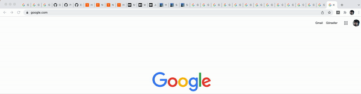

# chrome-auto-group

Group your chrome tabs automatically according to domain names.




# Usage

1. Clone repository.
```
git clone https://github.com/cemasma/chrome-auto-group.git
```

2. Open extension page of your chrome browser.
```
chrome://extensions
```

3. Click "Load unpacked" button and select the directory that you clone the projet. Extension is ready to use.